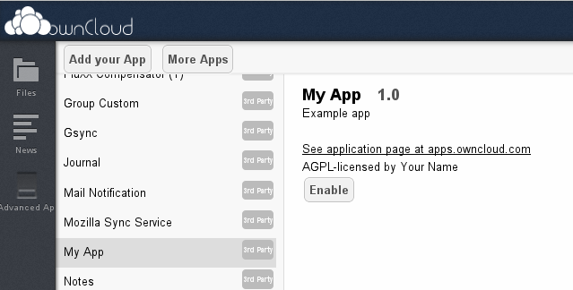
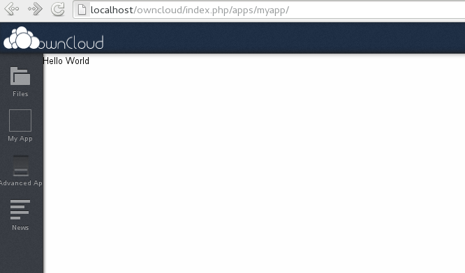

## About me

Bernhard Posselt (Raydiation)

* Python & Django fan

Working on:

* App Framework app
* News (RSS) app
* Documentation
* Testing

---

## Why

Fun:

* Awesome community
* No one-man show

Needs:

* You want to keep your data
* You want a high quality platform
* You want a special feature

Yeah, but:

* Devs will surely deliver

---

## Don't be the bear

---

## Get the source, Luke!

* [Set up your developement environment](http://doc.owncloud.org/server/5.0/admin_manual/installation.html#prerequisites)

* Clone the code from [GitHub](https://github.com/owncloud):

        sudo chmod o+rw /var/www
        cd /var/www
        git clone https://github.com/owncloud/core.git owncloud
        git clone https://github.com/owncloud/apps.git apps
        git clone https://github.com/owncloud/3rdparty.git 3rdparty

        mkdir owncloud/data
        sudo chown -R www-data:www-data owncloud/config
        sudo chown -R www-data:www-data owncloud/data
        sudo chown -R www-data:www-data owncloud/apps
        sudo chmod -R o-rw /var/www

---

## Create the app - Metadata

* Create folder in lower case:

        sudo mkdir -p /var/www/apps/myapp/appinfo
        sudo chown -R user:group /var/www/apps/myapp

* Set metadata in __appinfo/info.xml__:

        :::xml

        <?xml version="1.0"?>
        <info>
            <id>myapp</id>
            <name>My App</name>
            <description>Example app</description>
            <version>1.0</version>
            <licence>AGPL</licence>
            <author>Your Name</author>
            <require>5</require>
        </info>

---

## Create the app - Navigation entry

* Create navigation entry in __appinfo/app.php__:

        :::php
        <?php

        \OCP\App::addNavigationEntry(array( 
            'id' => 'myapp',
            'order' => 74,
            'href' => \OCP\Util::linkToRoute('myapp_index'),
            'icon' => \OCP\Util::imagePath('myapp', 'nav-icon.png') // add this by yourself ;),
            'name' => 'My App'
        ));

---

## Create the app - Route

* Create the initial route in __appinfo/routes.php__:

        :::php
        <?php
        $this->create('myapp_index', '/')->action(
            function($params){ require __DIR__ . '/../index.php'; }
        );

* Using App Framework (Look up the [DIContainer](http://doc.owncloud.org/server/master/developer_manual/app/appframework/container.html) class):
        
        :::php
        <?php
        use \OCA\AppFramework\App;
        use \OCA\MyApp\DependencyInjection\DIContainer;
        $this->create('myapp_index', '/')->action(
            function($params){
                App::main('PageController', 'methodName', $params, new DIContainer());
            }
        );

---

## Create the app - Logic

* Create the logic in __index.php__:

        :::php
        <?php
        // Look up other security checks in the docs!
        \OCP\User::checkLoggedIn();
        \OCP\App::checkAppEnabled('myapp');

        $tpl = new OCP\Template("myapp", "main", "user");
        $tpl->assign('msg', 'Hello World');
        $tpl->printPage();

---

## Create the app - Logic

* Using the App Framework:

        :::php
        <?php
        class PageController extends \OCA\AppFramework\Controller\Controller {

            public function __construct($api, $request){
                parent::__construct($api, $request);
            }

            /**
             * @CSRFExemption
             * @IsAdminExemption
             * @IsSubAdminExemption
             */
            public function index(){
                return $this->render('main', array(
                    'msg' => 'Hello World'
                ));
            }
        }
---

## Create the app - Template

* Create the template in __templates/main.php:
        
        :::php
        
<?php p($_['msg']); ?>

* Using the App Framework

        :::php
        
{{ msg }}

---

## Enable the app

* Link the app into the __owncloud/apps/__ folder:

        sudo ln -s /var/www/apps/myapp /var/www/owncloud/apps/

* Enable it on the apps page:

---

## Enjoy the result

* Congratulations! You've written your first app!

---

## Where to go from here

* Read the [documentation](http://doc.owncloud.org/server/master/developer_manual/app/index.html)
* Check the [security guidelines](http://doc.owncloud.org/server/master/developer_manual/app/general/security.html)
* Watch [Google's Clean Code Talks](http://www.youtube.com/watch?v=4F72VULWFvc&playnext=1&list=PLBDAB2BA83BB6588E&feature=results_main)
* Join us on __#owncloud-dev__ in [irc.freenode.net](irc://irc.freenode.net)
* Subscribe to the [mailinglist](https://mail.kde.org/mailman/listinfo/owncloud)

Slides:

* Repo on Github: [https://github.com/Raydiation/owncloud-app-slides](https://github.com/Raydiation/owncloud-app-slides)

* Built with patched python lib [mcider](https://github.com/ogom/python-mcider) (Google IO)

